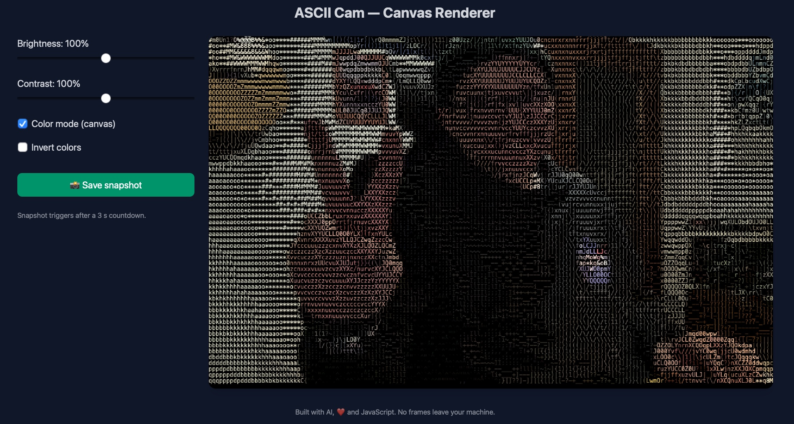

# ASCII Cam

A real-time ASCII art webcam converter that runs entirely in your browser. Transform your webcam feed into ASCII characters with adjustable settings and snapshot capabilities.

<p align="center">
  
</p>

## Features

- 🖥️ **Real-time conversion** of webcam feed to ASCII art
- 🎨 **Adjustable settings**:
  - Brightness
  - Contrast
  - Color mode
  - Invert colors
- 📸 **Snapshot functionality** with countdown timer
- 💾 **Local saving** of ASCII snapshots as PNG images
- 🔒 **Privacy-focused**: All processing happens locally - no data leaves your device

## How It Works

ASCII Cam captures your webcam feed and converts each frame into ASCII characters based on pixel brightness. The application uses HTML5 Canvas for rendering, providing efficient performance even in color mode.

## Usage

1. Visit the [ASCII Cam](https://10w73.github.io/ascii-cam/) website
2. Allow access to your webcam when prompted
3. Adjust settings as desired:
   - Move sliders to change brightness and contrast
   - Toggle color mode or invert colors
4. Click "Save snapshot" to capture an image with a 3-second countdown

## Technical Implementation

- Pure JavaScript, HTML, and CSS - no external dependencies except TailwindCSS
- Canvas-based rendering for optimal performance
- File System Access API for modern browsers, with fallback download mechanism

## Local Development

1. Clone this repository:
   ```
   git clone https://github.com/10w73/ascii-cam.git
   ```
2. Open `ascii-cam.html` in your browser

## License

MIT