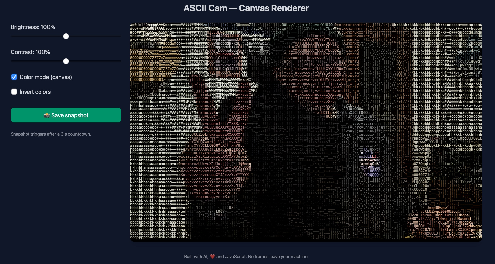

# ASCII Cam

A real-time ASCII art webcam converter that runs entirely in your browser. Transform your webcam feed into ASCII characters with adjustable settings and snapshot capabilities.

<p align="center">
  
</p>

## Features

- **Real-time conversion** of webcam feed to ASCII art
- **Adjustable controls**:
  - Detail (character resolution: 60–300 columns)
  - Brightness and contrast (GPU-accelerated via canvas filters)
  - Color mode
  - Invert colors
  - Mirror toggle (default on)
- **Snapshot** with 3-second countdown and File System Access API support
- **Privacy-focused**: all processing is local — no frames leave your device

## How It Works

1. The webcam feed is drawn onto a hidden capture canvas **scaled down to grid dimensions** (e.g. 160×45 instead of 1280×720). The browser's bilinear interpolation provides area-averaged color per cell for free.
2. Brightness, contrast and invert are applied as `CanvasRenderingContext2D.filter` — GPU-accelerated, no per-pixel math.
3. The small `ImageData` buffer is read and each pixel is mapped to an ASCII character via a 70-level density ramp.
4. In monochrome mode, entire rows are batched into single `fillText` calls for fewer draw operations.

## Usage

1. Visit [ASCII Cam](https://10w73.github.io/ascii-cam/)
2. Allow webcam access when prompted
3. Adjust sliders and toggles in the sidebar
4. Click **Save Snapshot** to capture a PNG with a 3-second countdown

## Technical Details

- Zero external dependencies — pure HTML, CSS and JavaScript (ES module)
- Apple-native dark UI (system font stack, iOS-style grouped controls and toggle switches)
- `willReadFrequently` hint on capture context for optimal `getImageData` performance
- `visibilitychange` listener pauses rendering when the tab is hidden
- Responsive layout (sidebar + canvas on desktop, stacked on mobile)
- Accessible: screen-reader-friendly toggles, `focus-visible` outlines

## Local Development

```sh
git clone https://github.com/10w73/ascii-cam.git
```

Open `ascii-cam.html` in any modern browser — no build step required.

## License

MIT